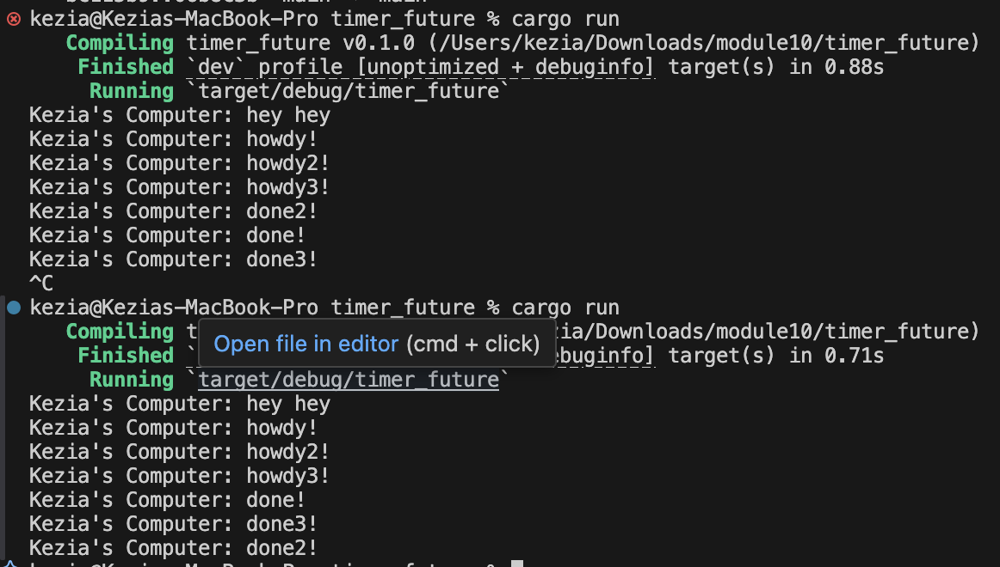

# Kezia Salsalina Agtyra Sebayang - 2306172086

### Experiment 1.2

I added the println! call immediately after spawner.spawn() and observed that “hey hey” printed before any other output. I initially expected spawning the task to run it at once, but spawn only registers the future with the executor rather than executing it. The main function then proceeds immediately, so my synchronous println prints right away. Execution of the spawned task starts only when the executor polls it, which begins after I drop the spawner. At that point the executor runs the task, producing “howdy!”, waits two seconds for the timer future, and then prints “done!”. This demonstrates that task scheduling and task execution are decoupled where scheduling a future does not trigger its immediate execution.

### Experiment 1.3
I spawned three asynchronous tasks and commented out the drop(spawner) call. When I ran the program it printed “hey hey” immediately, then executed each spawned task in sequence, producing:

After the last “done3!” the executor never returned control because the spawner was still alive and its channel remained open. I then restored the drop(spawner) call before executor.run() and ran the code again. This time the executor saw that the spawner had been dropped, closed its task queue, processed all pending tasks, and exited cleanly. This demonstrates that dropping the spawner is required to signal there will be no further tasks and to allow the executor’s run loop to terminate once everything has finished.