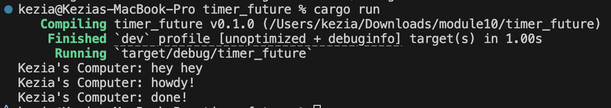

# Kezia Salsalina Agtyra Sebayang - 2306172086

- I added the println! call immediately after spawner.spawn() and observed that “hey hey” printed before any other output. I initially expected spawning the task to run it at once, but spawn only registers the future with the executor rather than executing it. The main function then proceeds immediately, so my synchronous println prints right away. Execution of the spawned task starts only when the executor polls it, which begins after I drop the spawner. At that point the executor runs the task, producing “howdy!”, waits two seconds for the timer future, and then prints “done!”. This demonstrates that task scheduling and task execution are decoupled where scheduling a future does not trigger its immediate execution.

